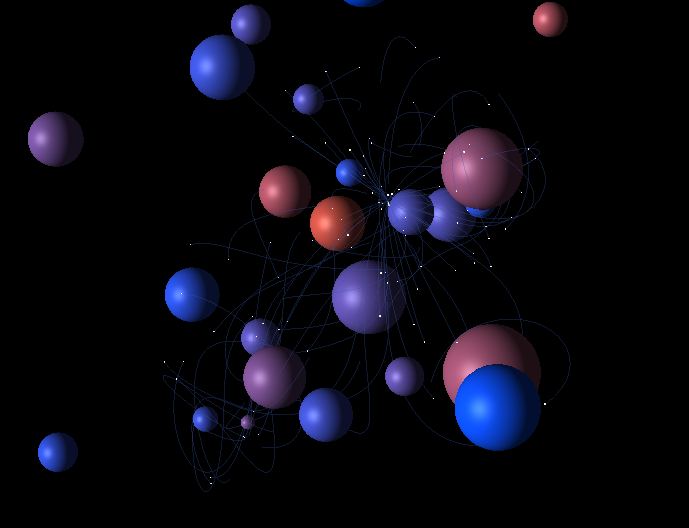

# Three.js particle gravity demo
A particle demo with trails using Three.JS library.

## How it works
The gravity for each dot is calculated using Newton's gravity formula. It's position is
then collected to display a line trail. This demonstrates usage of manual mesh creation
and management of its vertices.

Checkout a demo [here](https://charlieamer.github.io/threejs-gravity/).